# ⚡ Hi there, I'm Ivan! 

<div align="center">
  
  ```diff
  + class Developer {
  +   name     = "Ivan";
  +   nickname = "van4xx";
  +   role     = "Full Stack Developer";
  +   skills   = "[ TypeScript, React, Next.js, Node.js ]";
  + }
  ```
  
  
</div>

## 🚀 About Me
- 💻 Full Stack Developer passionate about creating digital magic
- 🌱 Currently exploring the depths of AI and Machine Learning
- ⚡ Fun fact: I can code while sleeping (in my dreams)

## 🛠 Tech Stack


## 📊 GitHub Stats

<div align="center">
  
  
</div>

## 🔥 Streak Stats
<div align="center">
  
  <br/>
  
</div>

## 📈 Contribution Graph
<div align="center">
  
</div>

## 📫 Connect With Me
[](https://linkedin.com/in/van4xx)
[](https://t.me/van4xx)
[](https://vk.com/van4xx)
[](https://webitlab.ru)

<div align="center">
    
    
</div> 